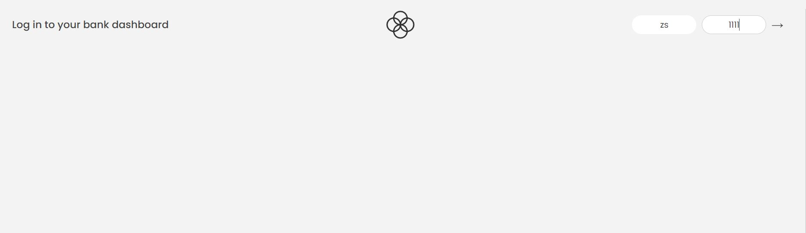
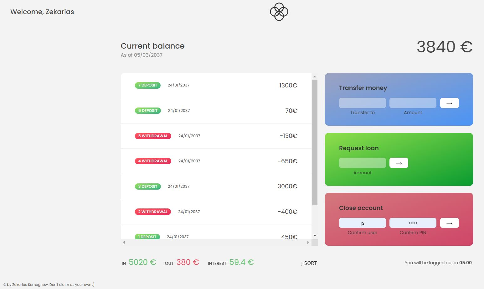

# Fake Bank Application
This is a fake bank application to practice JavaScript Array methods and Dom manipulation. Array is the most important and widely used data structure in JavaScript.

## Some of JavaScript Array methods used in this Application

- Array methods that mutate the original array: **push**, **unshift**, **pop**, **shift**, **splice**, **fill**, **reverse**, **sort**
- Array methods that return new array: **map**, **filter**, **slice**, **concat**, **flat**, **flatMap**
- Array methods that return an element: **find**
- Array methods that return index of an element in an array: **indexof**, **findIndex**
- Array methods that return boolean: **includes**, **some**, **every**
- Array methods that return a string from all array elements: **join**
- Array methods that transform an array to single value: **reduce**

